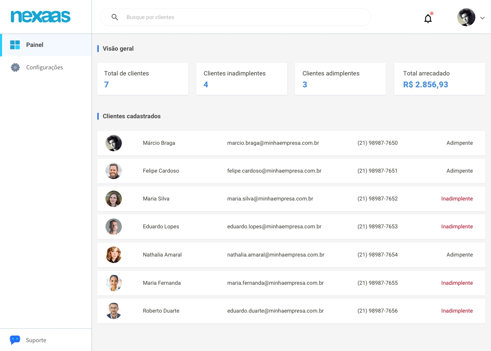

# Desafio_Frontend

<p align="center">
  
</p>

## 💻 Projeto

Projeto de front end desenvolvido para um teste de vaga para empresa Nexaas, para aprimorar os conhecimentos em NextJS. Esse desafio pode ser encontrado através [deste link](https://github.com/myfreecomm/desafio-frontend/tree/master) no github. Ao inves de usar a API desponibilizada, foi utilizado o supabase para poder guardar os dados.

## ✨ Tecnologias

- [NextJS](https://nextjs.org/)
- [React](https://reactjs.org)
- [TypeScript](https://www.typescriptlang.org/)
- [Tailwind CSS](https://tailwindcss.com/)
- [Supabase](https://supabase.com/)

## 🚀 Como executar

Clone o projeto e acesse a pasta do mesmo.

```bash
$ git clone https://github.com/ViniciusBussolo1/Desafio_FrontEnd.git
$ cd Desafio_FrontEnd
```

Para iniciá-lo, siga os passos abaixo:

```bash
# Instalar as dependências
$ npm install
# Iniciar o projeto
$ npm run dev
```

O app estará disponível no seu browser pelo endereço  http://localhost:3000/.
